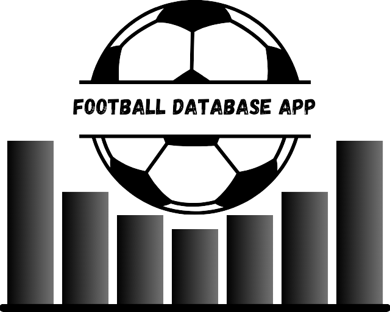
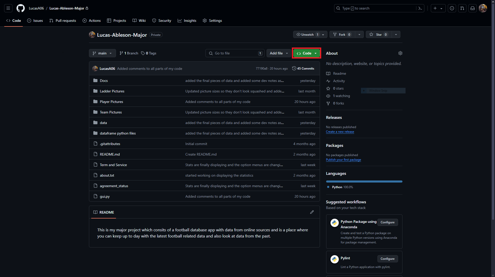
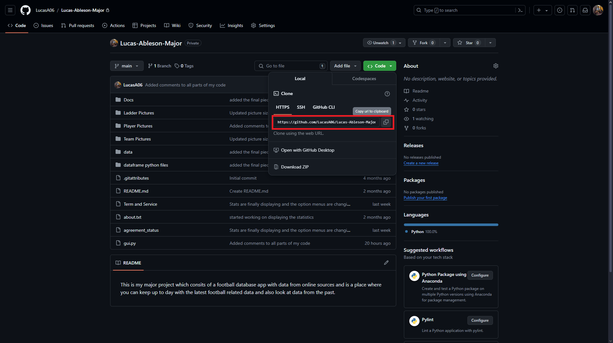
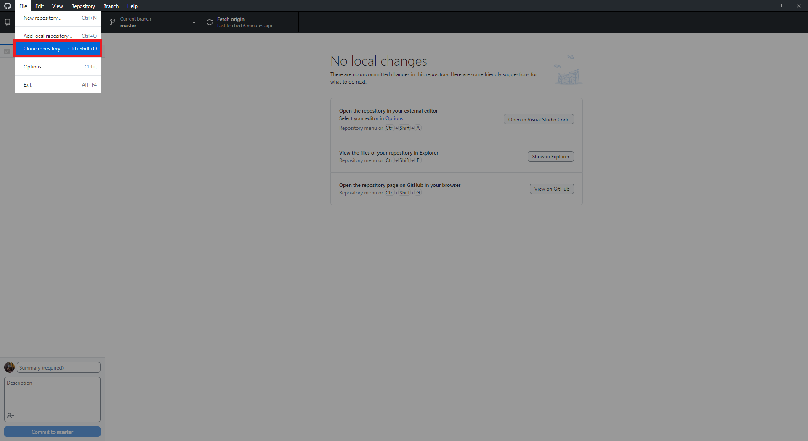
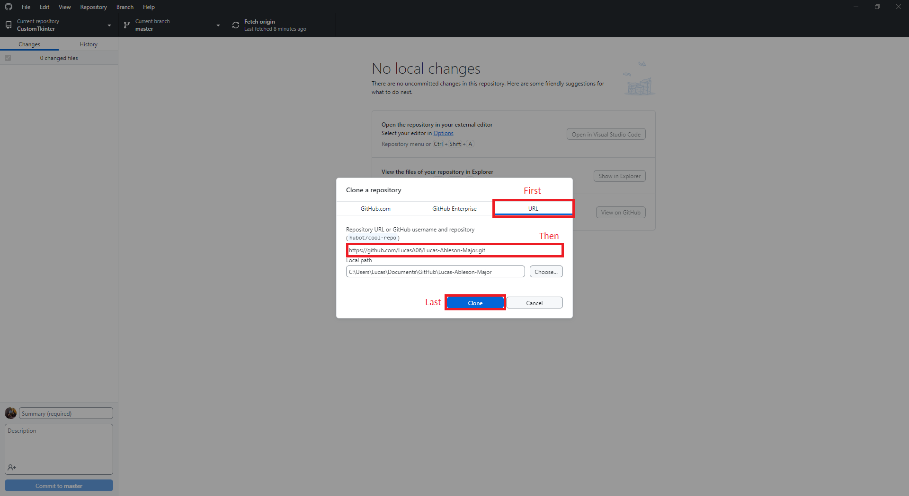
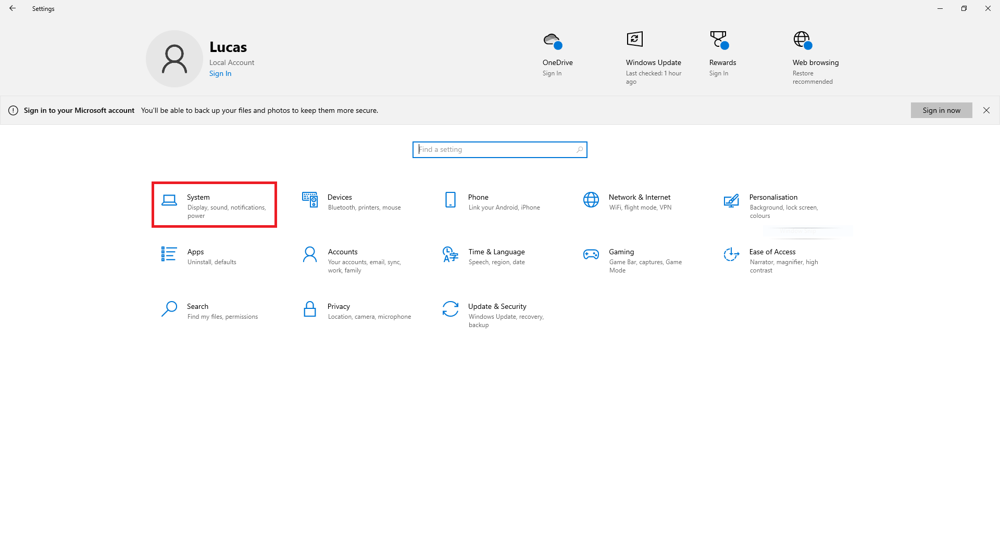
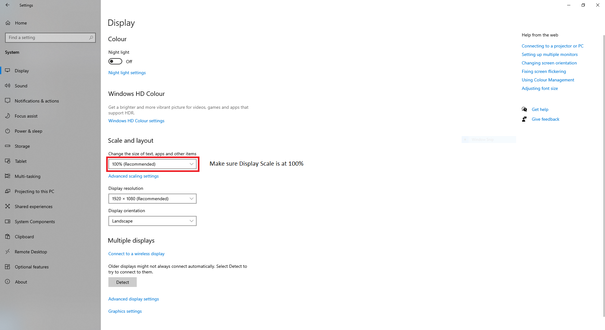
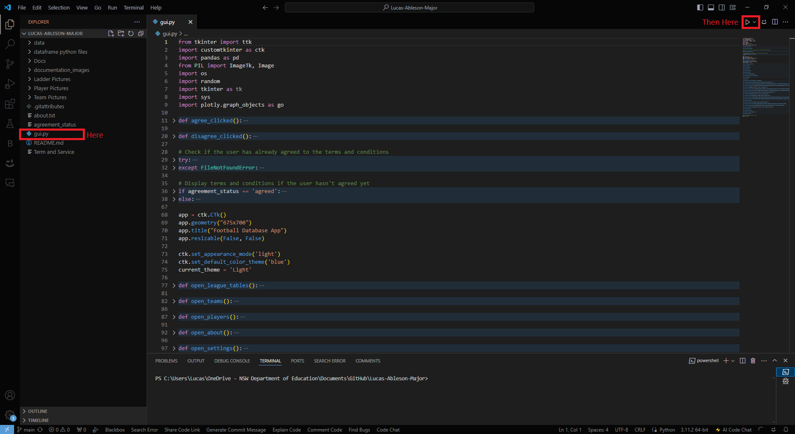
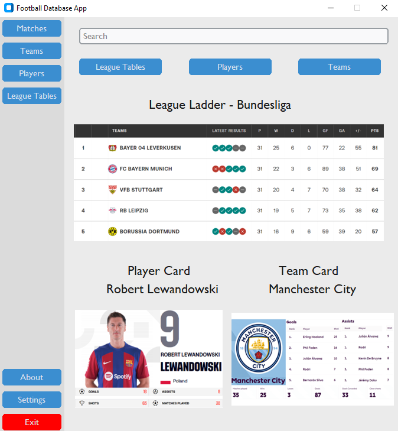
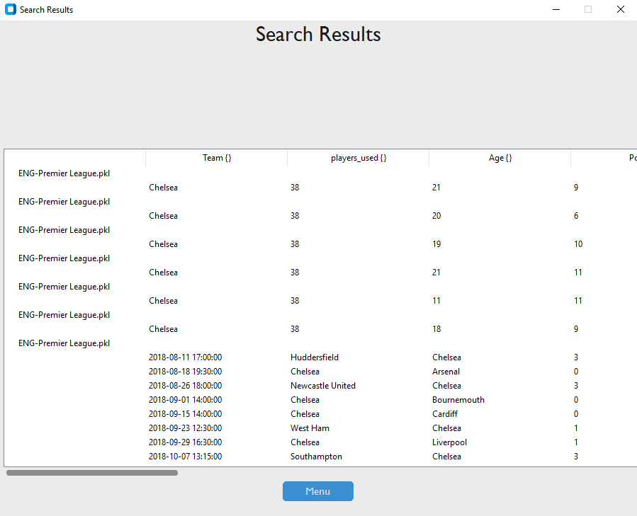

<p align="center">
  <picture>
    <source media="(prefers-color-scheme: dark)" srcset="./documentation_images/icon.png">
    
  </picture>
</p>

# Football Database App
*By Lucas Ableson*
## Project Description
The Football Database App is a dynamic application designed to provide comprehensive statistics and insights into football leagues, teams, and players. The app leverages a robust database to offer users a detailed overview of matches, player performance, team standings, and more. Users can easily query the database to retrieve specific information, making it an essential tool for football enthusiasts, analysts, and statisticians.

## How to Install and Run the Project
Prerequisites
* Ensure you have Python installed (version 3.7 or higher recommended).
* Install the required dependencies listed in requirements.txt.

### Installation Steps
Clone the Repository:






Or clone via git bash:
```bash
git clone https://github.com/LucasA06/Lucas-Ableson-Major.git
```

To install requirements.txt:
```bash
py -m pip install -r requirements.txt
```

### Important Note:
To ensure the application displays correctly, set your computer's display scale to 100%. On Windows, you can do this by navigating to Settings > System > Display and adjusting the scale and layout settings to 100%.




Install Dependencies:

```bash
pip install -r requirements.txt
```

Run the Application:




## How to Use
Accessing the App:

- Home Page: Provides an overview of the latest matches and updates.
- Teams: Browse through a list of football teams, view team details, and standings.
- Players: Search for players, view player statistics, and performance metrics.
- Matches: Explore match schedules, results, and detailed match reports.
- League Table: Access comprehensive statistics and analytics for the certain leagues and seasons.
- About: Read about the app and the creators of the app.
- Settings: Change selected settings to personal preferences.

  

### Querying the Database:

- Use the search bar and filters to query the database for specific information.

- Generate custom reports and visualizations based on the data available.

    

